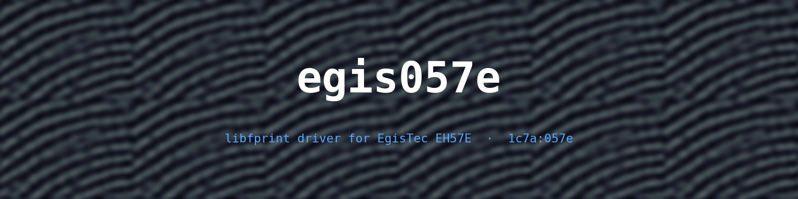
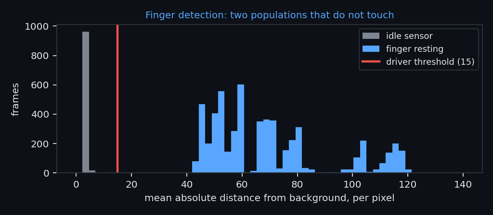
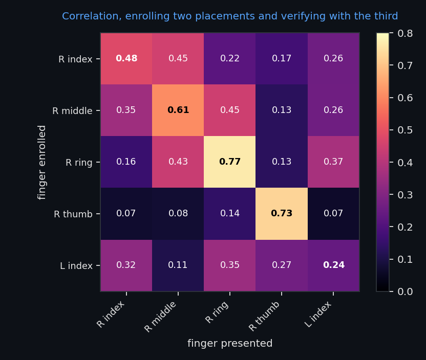
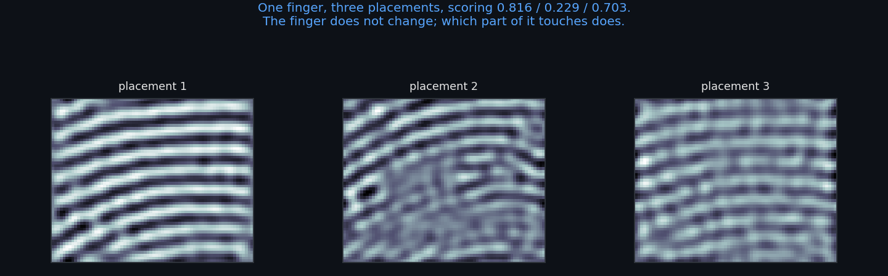

<div align="center">



**A working libfprint driver for the EgisTec EH57E fingerprint sensor
(`1c7a:057e`) — the one inside the power button of Samsung Galaxy Book laptops.**

[](#status)
[](#requirements)
[](https://gitlab.freedesktop.org/libfprint/libfprint)
[](LICENSE)
[](../../actions)
[](#starting-point)

</div>

---

## Contents

- [If your sensor is a different one](#if-your-sensor-is-a-different-one)
- [Status](#status)
- [Starting point](#starting-point) · [Protocol](#protocol)
- [Why it does not use minutiae](#why-it-does-not-use-minutiae)
- [How matching works](#how-matching-works) · [Measurements](#measurements)
- [Methods that were tried and lost](#methods-that-were-tried-and-lost)
- [Requirements](#requirements) · [Building](#building) · [Usage](#usage)
- [Known limitations](#known-limitations) · [Security](SECURITY.md)
- [Roadmap](#roadmap) · [Contributing](CONTRIBUTING.md)
- [Repository layout](#repository-layout) · [Method notes](#method-notes)

---

## If your sensor is a different one

**Read [`CHANGELOG.md`](CHANGELOG.md).** It is the full working log, kept
deliberately: not a list of releases, but a record of how an undocumented sensor
was taken apart — including every wrong turn, and why each direction was chosen
over the alternatives.

That log is likely to be more useful to you than the driver itself, because the
driver only fits `1c7a:057e`. The method transfers:

- how to tell a firmware that **executes** commands from one that merely **echoes**
  them back — the single mistake that can make an entire init sequence look like
  it worked;
- how to find the frame geometry in a stream when the datasheet does not exist:
  autocorrelation peaks give the row stride, and constant-variance regions give
  the padding;
- how to find the analog gain register that decides whether a finger is visible
  at all;
- how to establish that a sensor is **not** a swipe sensor before spending days
  building a stitcher for it;
- how to check whether minutiae matching can work on your contact area before
  committing to it — and what to do when it cannot;
- which published methods were measured here and **lost** (see
  [Methods that were tried and lost](#methods-that-were-tried-and-lost)), so you
  do not spend the same days on them.

Every claim in that log is attached to a measurement, and the measurement scripts
are in this repository. Where something was believed and later disproved, both
the belief and the disproof are still there.

The log is written in Italian; the code, the README and the commit messages are
in English.

---

## Status

| | |
|---|---|
| USB protocol | ✅ reconstructed |
| Image responds to finger | ✅ |
| Finger presence detection | ✅ |
| libfprint driver (`FpDevice`) | ✅ builds and runs |
| `fprintd-enroll` | ✅ `enroll-completed` |
| `fprintd-verify` | ✅ `verify-match` |
| PAM (GDM, lock screen, `sudo`) | ✅ via `authselect` |
| Rejection rate | ⚠️ needs work — see [Known limitations](#known-limitations) |
| Permanent installation | ⚠️ `fprintd` must currently be started by hand |

## Starting point

The sensor sits **inside the power button**. On
[linux-hardware.org](https://linux-hardware.org) it showed **0 successes across
118 machines**: no upstream driver, no public protocol documentation.

The device belongs to the **ET5XX** family (Egis internal project `ETU813`), not
the one covered by the existing libfprint drivers:

| | `egis0570` / `egismoc` | **ET5XX (this device)** |
|---|---|---|
| CmdID | `0x00` read, `0x01` write | `0x60`–`0x64` |
| Behaviour | firmware **echoes** the bytes back | commands actually execute |

One byte of difference, and it matters: with `0x01` the firmware only validates
the `EGIS` prefix and echoes the parameters back. An init sequence can report
"24/24 OK" without the device having executed anything at all. `probe6-echo-test.py`
is the test that exposes this.

## Protocol

```
Request:   "EGIS" (45 47 49 53) + CmdID (1B) + Param1 (1B) + Param2 (1B)
Response:  "SIGE" (53 49 47 45) + register (1B) + value (1B) + status (1B)
```

| Cmd | Meaning |
|---|---|
| `0x60` | read / execute register |
| `0x61` | write register |
| `0x62` | burst read |
| `0x63` | burst write |
| `0x64` | image request |

Bulk endpoints `OUT 0x01` / `IN 0x82`.

Each frame arrives as a **5320-byte** block, of which the first **3990 bytes are
the pixels** (70 × 57, 8 bit); the rest is a constant tail. To get a fresh frame
without resetting USB you need the re-arm command
`45 47 49 53 63 2c 02 00 13`.

### The register that made the finger invisible

The factory init leaves the analog front-end gain (register `0x12`) at `0x00`,
i.e. 18 levels of swing: the image is there but the finger is not visible.
Raising it to `0x0a`, with offset (`0x0f`) at `0x20`, makes the finger appear.

<div align="center">


</div>

## Why it does not use minutiae

libfprint matches fingerprints with **bozorth3** (NBIS), which looks for minutiae
— ridge endings and bifurcations. That does not work on this sensor, for a
geometric reason: the window is **4.3 × 3.6 mm, about 15 mm²**, and it contains
almost nothing but parallel ridges. Few minutiae, and rarely the same ones twice.

Measured with `cmp.c`, which calls libfprint's own `bozorth_probe_init` and
`bozorth_to_gallery` directly: **8 points** when comparing two images of the same
finger, against an acceptance threshold of **40**.

So the driver does not hand an image to libfprint. It implements its own matcher.

## How matching works

1. **Background.** On open, average 8 frames of an untouched sensor, discarding
   any frame contrasty enough to already contain a finger.
2. **Finger presence.** Mean absolute per-pixel distance from that background,
   *after removing any uniform level shift* (see
   [The stale background](#the-stale-background)). Idle sits between 2.4 and 4,
   a finger between 49 and 130. The threshold is **15**, comfortably in between.

   <div align="center">

   

   </div>

3. **Template.** Average of 40 frames (the finger is stationary, so averaging
   only cancels noise), then a **difference of Gaussians**, σ 1.2 / 3.5, acting as
   a band-pass around the ridge period — measured at **8 pixels**, i.e. 0.125
   cycles/pixel. Below that band is finger pressure, which changes on every touch
   and says nothing about identity; above it is thermal noise. The result is
   normalised to unit variance and quantised to `int8`.
4. **Matching.** Normalised cross-correlation, maximised over all shifts up to
   ±8 pixels. Acceptance threshold **0.50**.

### Measurements

Five fingers, three placements each. Placements 1 and 2 are enrolled, placement 3
verifies — it never enters enrolment, otherwise the experiment would only measure
how well something resembles itself.

<div align="center">



</div>

Genuine 0.241 – 0.767, impostors up to 0.451. No false accepts at 0.50.

> ⚠️ Twenty cross-finger comparisons are **not** a false-acceptance rate. That
> would take thousands. This only says the method separates, not how well.

### Why it needs many placements

On the same finger, different placements score very differently:

<div align="center">



</div>

With a 15 mm² window, moving two millimetres means photographing a different part
of the fingertip. The only lever measured to raise genuine scores is the number
of **distinct placements** enrolled (1 placement → 0.143, 2 → 0.288), while
quadrupling the frames taken from a single placement changes nothing. Hence
**30 enrolment stages**.

Widening the search instead makes things worse, because ridges are near-parallel
lines and more freedom lets them align with anybody:

| max shift | worst genuine | best impostor |
|---|---|---|
| **8** (chosen) | 0.241 | **0.451** |
| 12 | 0.317 | 0.600 |
| 16 | 0.439 | 0.611 |

### The stale background

Presence detection compares each frame against a background learned once, at
open. That broke twice in the first real session: the idle level stepped from
3.9 to 22–29 and never came back down, so the "wait for the finger to lift" phase
never completed and the driver went deaf. It stalled one enrolment at 6 stages
out of 20, and a run of verifications at the third.

It was a step, not a slow drift, and one that moved the whole image by the same
amount — a DC level change in the analog front end, not a change in texture.
Comparing pixels after subtracting the difference between the frame mean and the
background mean removes it by construction.

The cost is small: on the recorded captures, with a finger the minimum stays at
27.0 and without a finger the maximum is 25.8 (median 3.9). At a threshold of 15,
none of the 5616 finger frames falls below, and only one of 984 idle frames rises
above.

### Methods that were tried and lost

Negative results are kept here because they cost real work and would otherwise be
repeated.

| Method | Result |
|---|---|
| **Minutiae (bozorth3)** | 8 points, same finger, threshold 40. Too little area. |
| **Swipe stitching** | The finger does not translate over the sensor; only pressure changes. See [Method notes](#method-notes). |
| **Wider shift search** | Raises genuine scores, raises impostors more. |
| **BLPOC** | 3 errors out of 25 vs. 1 for plain correlation. |

**BLPOC** (band-limited phase-only correlation) deserves a note, because it is the
textbook method for small-area sensors. It divides the cross-spectrum by its own
magnitude, keeping only phase, which should make it insensitive to contrast and
pressure. Five variants were measured (low-pass block and ridge-frequency annulus,
with and without a Hann window); all of them scored 3 errors out of 25, against 1
for the normalised cross-correlation already in use. The likely reason is that
throwing away the magnitude also throws away ridge contrast, which on 15 mm² is
real information rather than a nuisance.

## Requirements

- Linux with `libfprint` 1.94.x and `fprintd`
- `meson`, `ninja`, a C toolchain, glib/gusb development headers
- Python 3 with `numpy` (analysis tools only) and `matplotlib` (only to
  regenerate the figures)

## Building

The driver lives inside a libfprint checkout:

```sh
git clone https://gitlab.freedesktop.org/libfprint/libfprint.git libfprint-src
cp driver/egis057e.[ch] libfprint-src/libfprint/drivers/
```

Register it in two places:

```meson
# meson.build
'egis057e': {},

# libfprint/meson.build
'egis057e' : files('drivers/egis057e.c'),
```

Then build:

```sh
meson setup libfprint-src/build libfprint-src
ninja -C libfprint-src/build
./libfprint-src/build/libfprint/fprint-list-supported-devices | grep 057e
```

## Usage

`fprintd` has to run against the locally built library rather than the system
one. The two cannot coexist: `net.reactivated.Fprint` is a single name on the
system bus.

```sh
sudo systemctl stop fprintd.service
sudo env LD_LIBRARY_PATH=$PWD/libfprint-src/build/libfprint \
     /usr/libexec/fprintd -t
```

`-t` disables the idle exit; without it `fprintd` takes the bus name and dies
after thirty seconds of silence, handing the name back to the system service.

From another terminal:

```sh
fprintd-enroll -f right-index-finger    # 30 placements
fprintd-verify -f right-index-finger
```

**Rest your finger, do not press:** the sensor *is* the power button, and pressing
suspends the laptop. Lift between placements and move the finger a little each
time — it is the *distinct* placements that count.

For PAM, enable the feature the distribution already ships:

```sh
sudo authselect enable-feature with-fingerprint
```

## Known limitations

- **Rejections.** On the first real verification run the scores were 0.625, 0.595
  and **0.358**: one below threshold. The measured remedy is more distinct
  placements at enrolment, hence 30 stages. Lowering the threshold is not, since
  0.358 sits below the measured impostor ceiling.
- **No serious FAR measurement.** See above.
- **No `identify`.** The driver advertises only `FP_DEVICE_FEATURE_VERIFY`: the
  margin between different fingers is not wide enough for one-against-many.
- **No udev rule** is emitted for `1c7a:057e`; `fprintd` runs as root, so it has
  not been needed so far.
- **Installation is not permanent.** `fprintd` must be launched by hand. With
  SELinux in `Enforcing`, pointing a system service at a library under `/home`
  would produce denials.
- **No anti-spoofing.** The matcher only looks at ridge texture.

## Roadmap

Ordered by expected payoff per unit of effort:

1. **Template update on successful verification.** Every accepted verification
   adds its sample to the stored print, so coverage of the fingertip grows with
   use. libfprint already has `FP_DEVICE_FEATURE_UPDATE_PRINT` for this. Costs
   the user nothing.
2. **Rotation tolerance.** Matching currently searches translations only, while a
   resting finger easily rotates ±15°. Cheap to add — but it belongs to the same
   family as the wider shift search, which the data rejected, so it has to be
   measured rather than assumed.
3. **Learned descriptors.** What the commercial sensors actually do, and genuine
   state of the art. Needs training data and does not sit comfortably inside a
   driver.

## Repository layout

| Path | Contents |
|---|---|
| `driver/` | the driver, to be copied into a libfprint checkout |
| `docs/` | README figures and the script that generates them from real data |
| `capture2.py` | base library: init, commands, frame reads |
| `capture-set.py` | records the test set (5 fingers × 3 placements) |
| `analisi.py` | measurement protocol: enrol 1+2, verify with 3 |
| `atterraggio.py` | is the start of a placement worse than the rest? (no) |
| `blpoc.py` | band-limited phase-only correlation, measured and rejected |
| `matchtest.c` | checks the driver's C matcher against the Python prototype |
| `cmp.c` | comparison against bozorth3 — the evidence that minutiae fail here |
| `probe*.py` | the protocol reconstruction, step by step |
| `CHANGELOG.md` | the full log, including method errors |

`probe*.py`, `stitch.py`, `mintest.c` and similar document measurements that have
since been superseded. They stay because the path matters as much as the result,
and because some of them describe **wrong** turns worth not taking again.

## Method notes

`CHANGELOG.md` records method errors as well as progress. Two are worth repeating
here, because both produced results that were false and convincing.

1. **The mosaic that never existed.** An attempt to reconstruct a large
   fingerprint by stitching consecutive frames produced a 115 × 189 pixel image
   with 44 minutiae. It was an artefact: phase correlation returns integer
   shifts, the real displacement between consecutive frames was 0.3 pixels, and a
   thousand ±1 pixel errors accumulate as a random walk. Measured against a held
   reference frame instead, the real displacement is **zero**: the finger does not
   translate over the sensor, only pressure changes. It is not a swipe sensor.
2. **The innocent landing.** The hypothesis that the driver was sampling the
   finger while it was still landing was reasonable and wrong: measured with
   `atterraggio.py`, the difference between the start, middle and end of a
   placement is **0.015**. Noise.

## Contributing

Bug reports, device reports and measurements are welcome. See
[CONTRIBUTING.md](CONTRIBUTING.md) — the one rule that matters is that every
claim comes with a measurement, and that negative results are kept rather than
discarded.

If you have an Egis sensor that is not `1c7a:057e`, the **Device report** issue
template is the place to start, even if nothing works yet.

## Security

Read [SECURITY.md](SECURITY.md) before relying on this for anything.

In short: the false-acceptance rate of this matcher **is not known** — it has
been measured against twenty impostor comparisons, which cannot establish a
rate. There is no liveness detection of any kind. The sensor images about 15 mm²
of skin, which is a hard limit on how much can be distinguished. Treat it as a
convenience in front of a password you still know, not as a security boundary.

## License

**LGPL-2.1-or-later**, the same as libfprint. Full text in [LICENSE](LICENSE).

The proprietary Egis/Microsoft binaries used as a reference during reverse
engineering are **not in this repository** and are not redistributable.

## Acknowledgements

- The [libfprint](https://gitlab.freedesktop.org/libfprint/libfprint) project and
  its existing Egis drivers, which provided exactly the right wrong starting
  point.
- NIST, for NBIS and for making it verifiable — even when the answer is "this
  method does not work here".
