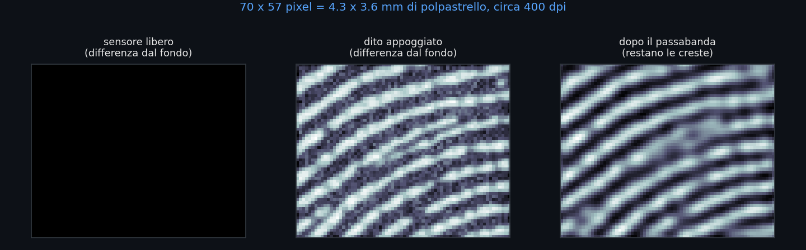
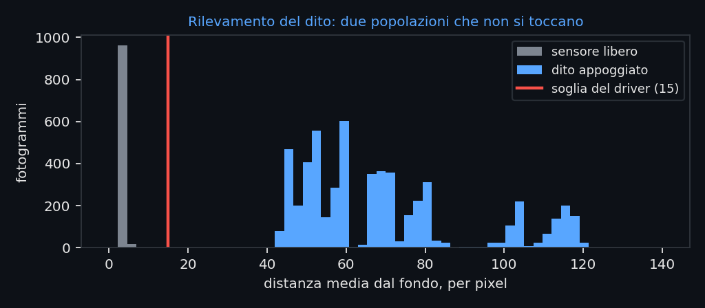
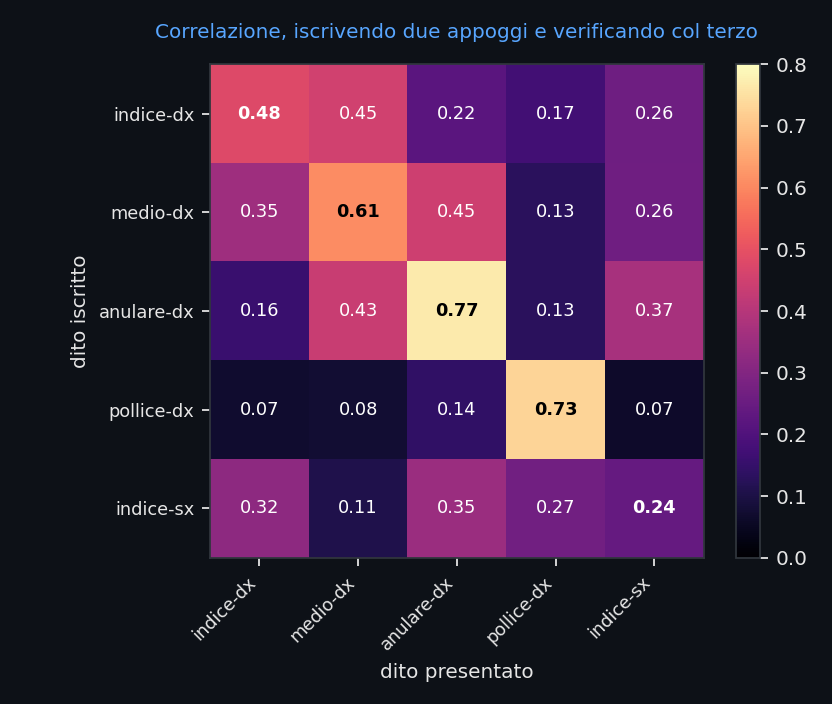
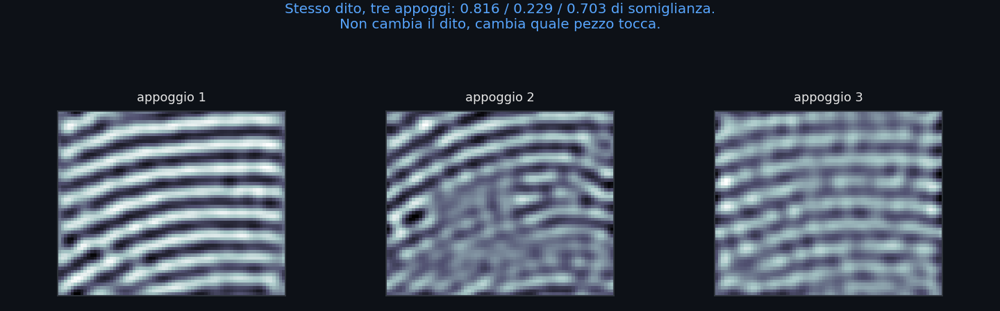

<div align="center">


**Driver libfprint per il sensore di impronte EgisTec EH57E (`1c7a:057e`),
quello dentro il tasto di accensione dei Samsung Galaxy Book.**

[](#stato)
[](#requisiti)
[](https://gitlab.freedesktop.org/libfprint/libfprint)
[](#licenza)
[](#il-punto-di-partenza)

</div>

---

> **English summary.** Working libfprint driver for the EgisTec EH57E fingerprint
> sensor (USB `1c7a:057e`), found in the power button of Samsung Galaxy Book
> laptops. The device had no Linux support and no documented successes. The
> protocol was reverse engineered from scratch; because the sensor images only
> ~15 mm² of skin, classic minutiae matching (NBIS/bozorth3) fails on it, so the
> driver implements its own band-passed correlation matcher instead. `fprintd`
> enrolment and verification both work. Code comments and documentation are in
> Italian.

---

## Stato

| Cosa | Stato |
|---|---|
| Protocollo USB | ✅ ricostruito |
| Immagine che reagisce al dito | ✅ |
| Rilevamento presenza dito | ✅ |
| Driver libfprint (`FpDevice`) | ✅ compila e gira |
| `fprintd-enroll` | ✅ `enroll-completed` |
| `fprintd-verify` | ✅ `verify-match` |
| PAM (GDM, lock screen, `sudo`) | ✅ tramite `authselect` |
| Tasso di rifiuto | ⚠️ da ridurre — vedi [Limiti noti](#limiti-noti) |
| Installazione permanente | ⚠️ per ora `fprintd` va lanciato a mano |

## Il punto di partenza

Il sensore sta **dentro il tasto di accensione**. Su
[linux-hardware.org](https://linux-hardware.org) risultavano **0 successi su 118
macchine**, nessun driver upstream, nessuna documentazione pubblica del
protocollo.

Il device appartiene alla famiglia **ET5XX** (progetto interno Egis `ETU813`),
non a quella coperta dai driver libfprint esistenti:

| | `egis0570` / `egismoc` | **ET5XX (questo device)** |
|---|---|---|
| CmdID | `0x00` read, `0x01` write | `0x60`–`0x64` |
| Esito | il firmware **echeggia** i byte | comandi eseguiti |

Un byte di differenza, ma decisivo: con `0x01` il firmware valida solo il
prefisso `EGIS` e rimanda indietro i parametri. Una sequenza di init può
risultare "24/24 OK" senza che il device abbia eseguito nulla. Lo smaschera
`probe6-echo-test.py`.

## Protocollo

```
Richiesta:  "EGIS" (45 47 49 53) + CmdID (1B) + Param1 (1B) + Param2 (1B)
Risposta:   "SIGE" (53 49 47 45) + registro (1B) + valore (1B) + status (1B)
```

| Cmd | Significato |
|---|---|
| `0x60` | read / execute register |
| `0x61` | write register |
| `0x62` | burst read |
| `0x63` | burst write |
| `0x64` | image request |

Endpoint bulk `OUT 0x01` / `IN 0x82`.

Ogni fotogramma arriva come blocco da **5320 byte**, di cui i primi **3990 sono
i pixel** (70 × 57, 8 bit) e il resto una coda costante. Per ottenere un
fotogramma nuovo senza resettare l'USB serve il comando di riarmo
`45 47 49 53 63 2c 02 00 13`.

### Il registro che rendeva il dito invisibile

L'init di fabbrica lascia il guadagno dello stadio analogico (registro `0x12`) a
`0x00`, cioè 18 livelli di escursione: l'immagine c'è ma il dito non si vede.
Portandolo a `0x0a`, con offset (`0x0f`) a `0x20`, il dito compare.

<div align="center">



</div>

## Perché non usa le minuzie

libfprint confronta le impronte con **bozorth3** (NBIS), che cerca minuzie —
biforcazioni e terminazioni delle creste. Su questo sensore non funziona, e la
ragione è geometrica: la finestra è di **4.3 × 3.6 mm, circa 15 mm²**, e ci
stanno quasi solo creste parallele. Poche minuzie, e quasi mai le stesse.

Misurato con `cmp.c`, che chiama direttamente `bozorth_probe_init` e
`bozorth_to_gallery` di libfprint: **8 punti** confrontando due immagini dello
stesso dito, contro una soglia di accettazione di **40**.

Il driver quindi non produce un'immagine per libfprint: implementa un
confronto proprio.

## Come confronta

1. **Fondo.** All'apertura media 8 fotogrammi a sensore libero, scartando quelli
   troppo contrastati (che conterrebbero già un dito).
2. **Presenza del dito.** Distanza media assoluta dal fondo, per pixel. A riposo
   sta fra 2.4 e 4, con un dito fra 49 e 130. La soglia è **15**, ampiamente in
   mezzo.

   <div align="center">

   

   </div>

3. **Modello.** Media di 40 fotogrammi (il dito è fermo, mediare abbatte solo il
   rumore), poi **differenza di gaussiane** σ 1.2 / 3.5 come passabanda attorno
   al periodo delle creste — misurato in **8 pixel**, cioè 0.125 cicli/pixel.
   Sotto quella banda c'è la pressione, che cambia a ogni appoggio e non dice
   niente sull'identità; sopra c'è il rumore termico. Il risultato è
   normalizzato a varianza unitaria e quantizzato a `int8`.
4. **Confronto.** Correlazione incrociata normalizzata, massimizzata su tutti gli
   scorrimenti fino a ±8 pixel. Soglia di accettazione **0.50**.

### Le misure

Cinque dita, tre appoggi ciascuna: si iscrivono gli appoggi 1 e 2, si verifica
con il 3 (che non entra mai nell'iscrizione, altrimenti si misurerebbe solo
quanto una cosa somiglia a se stessa).

<div align="center">



</div>

Genuini 0.241 – 0.767, impostori fino a 0.451. Nessun falso accesso a 0.50.

> ⚠️ Venti confronti fra dita diverse **non sono** un tasso di falsa
> accettazione. Per quello servirebbero migliaia di confronti. Questo dice solo
> che il metodo separa, non quanto bene.

### Perché servono tanti appoggi

Sullo stesso dito, appoggi diversi danno punteggi molto diversi:

<div align="center">



</div>

Con 15 mm² di finestra, spostarsi di due millimetri vuol dire fotografare
un'altra parte del polpastrello. L'unica leva misurata che alza i punteggi
genuini è il numero di **appoggi distinti** iscritti (1 appoggio → 0.143,
2 → 0.288), mentre quadruplicare i fotogrammi dello stesso appoggio non cambia
nulla. Da qui i **30 stage di iscrizione**.

Allargare invece lo scorrimento massimo peggiora le cose, perché le creste sono
righe quasi parallele e con più libertà si allineano con chiunque:

| scorrimento max | genuino peggiore | impostore migliore |
|---|---|---|
| **8** (scelto) | 0.241 | **0.451** |
| 12 | 0.317 | 0.600 |
| 16 | 0.439 | 0.611 |

## Requisiti

- Linux con `libfprint` 1.94.x e `fprintd`
- `meson`, `ninja`, toolchain C, header di sviluppo di glib/gusb
- Python 3 con `numpy` (solo per gli strumenti di analisi) e `matplotlib` (solo
  per rigenerare le figure)

## Compilazione

Il driver vive in un checkout di libfprint:

```sh
git clone https://gitlab.freedesktop.org/libfprint/libfprint.git libfprint-src
cp driver/egis057e.[ch] libfprint-src/libfprint/drivers/
```

Poi va registrato in due punti:

```meson
# meson.build
'egis057e': {},

# libfprint/meson.build
'egis057e' : files('drivers/egis057e.c'),
```

E si compila:

```sh
meson setup libfprint-src/build libfprint-src
ninja -C libfprint-src/build
./libfprint-src/build/libfprint/fprint-list-supported-devices | grep 057e
```

## Uso

`fprintd` va fatto girare con la libreria compilata invece di quella di sistema.
I due non possono convivere: `net.reactivated.Fprint` è un nome solo sul bus.

```sh
sudo systemctl stop fprintd.service
sudo env LD_LIBRARY_PATH=$PWD/libfprint-src/build/libfprint \
     /usr/libexec/fprintd -t
```

`-t` toglie l'uscita automatica: senza, `fprintd` prende il nome sul bus e muore
dopo mezzo minuto di silenzio, restituendolo al servizio di sistema.

Da un altro terminale:

```sh
fprintd-enroll -f right-index-finger    # 30 appoggi
fprintd-verify -f right-index-finger
```

**Appoggia il dito, non premere:** il sensore è il tasto di accensione, e una
pressione sospende il portatile. Stacca il dito fra un appoggio e l'altro e
spostalo un poco ogni volta: sono gli appoggi *distinti* a contare.

Per PAM basta abilitare la funzionalità già prevista dalla distribuzione:

```sh
sudo authselect enable-feature with-fingerprint
```

## Limiti noti

- **Rifiuti.** Sulla prima verifica reale i punteggi sono stati 0.625, 0.595 e
  **0.358**: uno sotto soglia. Il rimedio misurato è più appoggi distinti in
  iscrizione, da cui i 30 stage; abbassare la soglia no, perché 0.358 sta sotto
  il tetto degli impostori misurato.
- **Nessuna misura di FAR seria.** Vedi sopra.
- **Niente `identify`.** Il driver dichiara solo `FP_DEVICE_FEATURE_VERIFY`: il
  margine fra dita diverse non è abbastanza largo per un confronto
  uno-contro-molti.
- **Nessuna regola udev** viene emessa per `1c7a:057e`; `fprintd` gira da root,
  quindi finora non è servita.
- **Installazione non permanente.** `fprintd` va lanciato a mano. Con SELinux in
  `Enforcing`, puntare un servizio di sistema a una libreria sotto `/home`
  produrrebbe negazioni.
- **Nessun anti-spoofing.** Il confronto guarda solo la trama delle creste.

## Struttura del repo

| Percorso | Cosa |
|---|---|
| `driver/` | il driver, da copiare in un checkout di libfprint |
| `docs/` | figure del README e lo script che le genera dai dati veri |
| `capture2.py` | libreria di base: init, comandi, lettura fotogrammi |
| `capture-set.py` | cattura il set di prova (5 dita × 3 appoggi) |
| `analisi.py` | protocollo di misura: iscrive 1+2, verifica con 3 |
| `atterraggio.py` | l'inizio dell'appoggio vale quanto il resto? (no) |
| `matchtest.c` | verifica che il C del driver dia gli stessi numeri di Python |
| `cmp.c` | confronto con bozorth3, cioè la prova che le minuzie non bastano |
| `probe*.py` | la ricostruzione del protocollo, passo per passo |
| `CHANGELOG.md` | il diario completo, errori di metodo inclusi |

Gli script `probe*.py`, `stitch.py`, `mintest.c` e simili documentano misure
ormai superate. Restano perché il percorso conta quanto il risultato, e perché
alcuni descrivono strade **sbagliate** che è utile non ripercorrere.

## Note metodologiche

Il `CHANGELOG.md` registra anche gli errori di metodo, non solo i progressi. Due
meritano di essere citati qui perché hanno prodotto risultati falsi e
convincenti:

1. **Il mosaico che non esisteva.** Un tentativo di ricostruire un'impronta
   grande unendo fotogrammi successivi produsse un'immagine da 115 × 189 pixel
   con 44 minuzie. Era un artefatto: la correlazione di fase restituisce
   scorrimenti interi, lo spostamento reale fra fotogrammi consecutivi era di
   0.3 pixel, e mille errori da ±1 pixel si sommano come una passeggiata
   aleatoria. Misurando contro un fotogramma di riferimento tenuto fermo, lo
   spostamento reale risulta **zero**: il dito non trasla sul sensore, cambia
   solo la pressione. Non è un sensore a scorrimento.
2. **L'atterraggio innocente.** L'ipotesi che il driver campionasse il dito
   mentre stava ancora atterrando era ragionevole e sbagliata: misurata con
   `atterraggio.py`, la differenza fra inizio, centro e fine dell'appoggio è
   **0.015**, cioè rumore.

## Licenza

Il driver segue la licenza di libfprint, **LGPL-2.1-or-later**.

I binari proprietari Egis/Microsoft usati come riferimento durante il reverse
engineering **non sono in questo repo** e non sono ridistribuibili.

## Ringraziamenti

- Il progetto [libfprint](https://gitlab.freedesktop.org/libfprint/libfprint) e
  i suoi driver Egis esistenti, che hanno dato il punto di partenza sbagliato
  giusto da cui cominciare.
- NIST, per NBIS e per averlo reso verificabile — anche quando la risposta è
  "questo metodo qui non funziona".
